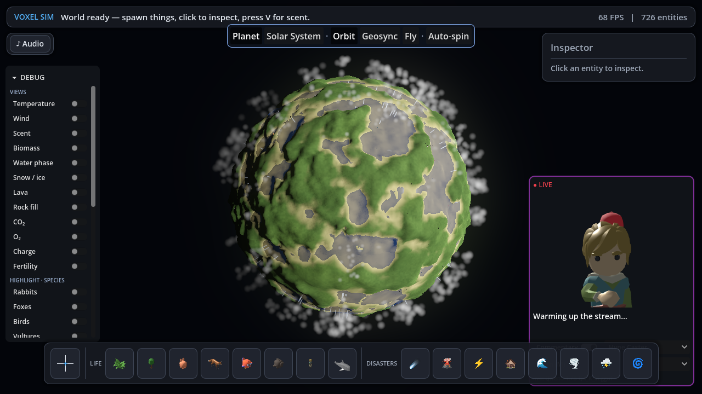
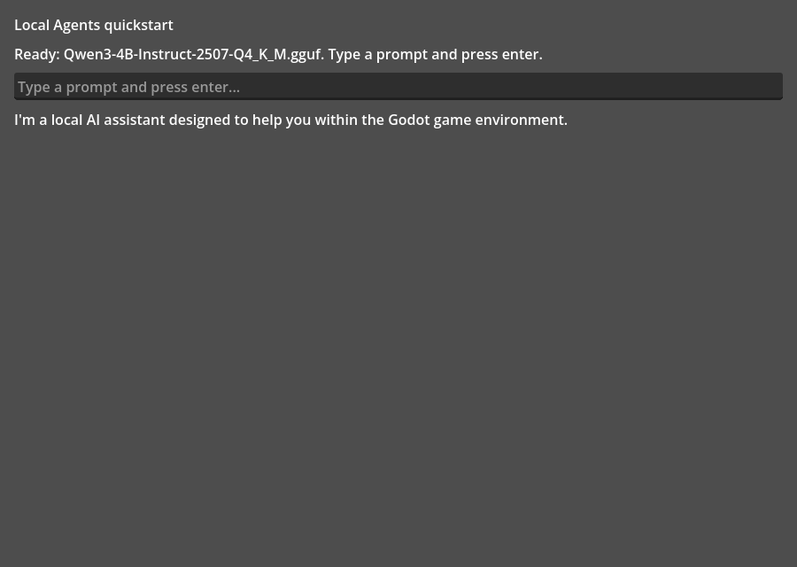

# Local Agents (Godot)

**Local large language models, running fully offline, driving both actions and responses inside a
Godot game.** No cloud, no API keys, no network round-trip — the model runs on the player's own
machine through a llama.cpp-backed GDExtension. A `LocalAgentsAgent` node loads a GGUF model and
gives you two things at once: **responses** (chat, dialogue, a live commentator) and **actions**
(a creature deciding to flee, a streamer reacting to what just happened on screen).

The flagship showcase is an emergent voxel planet where herds think, disasters emerge from physics,
and a local-LLM streamer narrates the chaos live — all offline.



## What it is

- **Offline-first local LLM in an engine.** Drop one node, point it at a GGUF model, call
  `think()`, and read the reply. Everything runs in-process on the player's hardware.
- **Actions and responses from the same runtime.** The same agent that answers a chat prompt can
  emit an `action_requested` signal that game code turns into behavior. Creatures in the voxel sim
  use fast local rules for the common case and call the model for novel situations; a streamer
  overlay watches the sim and comments on it with generated speech (TTS) and, optionally, listens
  back (STT).
- **A native GDExtension** (`localagents`) wrapping llama.cpp for text generation, plus whisper.cpp
  for transcription and Piper for speech — all embedded, all local.

## Prerequisites (both are required to run)

A fresh clone will **not** run until you have these two things. Neither is committed to the repo.

### 1. The native extension binary

The `localagents` GDExtension is a compiled C++ library (`bin/` is a gitignored build artifact). Get
it one of two ways:

- **Download a CI artifact (no toolchain needed).** The
  [Build Extension (Cross-Platform)](.github/workflows/build-extension.yml) GitHub Actions workflow
  builds Linux, Windows, and macOS binaries and uploads each as an artifact named
  `localagents-<platform>-bin`. Download the one for your platform from the workflow run and unzip it
  into `addons/local_agents/gdextensions/localagents/bin/`.
- **Build it locally.** From the extension directory:

  ```bash
  cd addons/local_agents/gdextensions/localagents
  ./scripts/fetch_dependencies.sh        # godot-cpp, llama.cpp, whisper.cpp, sqlite (+ the default model & voices)
  ./scripts/build_extension.sh --platform macos   # or: linux | windows
  ```

  This produces `bin/localagents.<platform>.{dylib,so,dll}` plus the bundled runtimes. (Running
  `fetch_dependencies.sh` without `--skip-models` also downloads the default GGUF model, covering
  step 2 in one shot.)

If the binary is missing, the runtime status will say so ("Native runtime missing…") instead of
silently doing nothing.

### 2. A GGUF model

The default model is **`Qwen3-4B-Instruct-2507-Q4_K_M.gguf`**, resolved from
`user://local_agents/models/qwen3-4b-instruct/` (or the in-repo
`addons/local_agents/models/` fetched by the build script).

The friendliest way to get one: open the project in Godot, enable the **Local Agents** plugin, and
use the **Local Agents → Downloads** bottom panel to fetch a model. It lands in the user models
directory automatically.

## 60-second quickstart

1. **Get the native binary** (above) — download the CI artifact or build locally.
2. **Get a model** (above) — the editor **Local Agents → Downloads** panel is the easy path.
3. **Open the quickstart scene** `addons/local_agents/examples/AgentQuickstart.tscn`, press play,
   type a prompt, and press enter.



That scene is literally **one `Agent` node plus a prompt box and a reply label**. To build the same
thing from scratch, drop a `LocalAgentsAgent` node (once the plugin is enabled it shows up as
**Agent** in the Add Node dialog) and wire five lines:

```gdscript
@onready var agent: LocalAgentsAgent = %Agent

func _ready() -> void:
    agent.configure()                                  # picks up the default model + runtime
    agent.model_output_received.connect(_on_reply)     # fires when the model answers
    var result: Dictionary = agent.think("Say hello.") # runs the local model
    if not result.get("ok", true):
        push_warning("Agent unavailable: %s" % result.get("error", ""))

func _on_reply(text: String) -> void:
    print(text)
```

`think(prompt)` records the prompt, runs the local model, returns a result `Dictionary`, and emits
`model_output_received` with the text. For TTS/STT use `say(text)` / `listen()`; to drive game
behavior, connect the `action_requested(action, params)` signal.

## Demos

Each demo is a scene you can open and run. The examples form a **ladder**: each rung adds one
capability over the last, so you can watch features layer up from a one-node chatbot to the flagship
planet sim. The friendliest entry point is the **launcher**, which lists every demo with a one-line
description and an Open button.

| Demo | Scene | What it shows |
| --- | --- | --- |
| **Demo launcher** (start here) | `addons/local_agents/examples/DemoLauncher.tscn` | The front door — a menu of every demo below, ordered simplest to fullest, each with a one-click Open button. |
| **1. Quickstart** | `addons/local_agents/examples/AgentQuickstart.tscn` | The smallest "talk to a local LLM" scene — one `Agent` node, a prompt box, a reply. |
| **2. Agent drives actions** | `addons/local_agents/examples/AgentActionsDemo.tscn` | The actions loop that makes an agent more than a chatbot — the model's reply becomes `enqueue_action` calls that recolor and pulse an on-screen orb (manual buttons fire the same actions, so it works with no model). |
| **3. Two agents converse** | `addons/local_agents/examples/AgentConversationDemo.tscn` | Cognition + memory — Ada and Ben take turns, and every line is recorded as a node in a shared `LocalAgentsGraph` (chained by `then` edges) that grows as the conversation's memory. |
| **4. Chat** | `addons/local_agents/examples/ChatExample.tscn` | A fuller chat UI with model/inference configuration, runtime-health status, and saved conversations. |
| **5. 3D Agent** | `addons/local_agents/examples/Agent3DExample.tscn` | A talking 3D agent prefab driven by the same runtime, with an on-screen setup checklist. |
| **6. Graph** | `addons/local_agents/examples/GraphExample.tscn` | The `LocalAgentsGraph` resource (nodes/edges) for structured agent knowledge — runs without a model. |
| **Voxel planet sim** (flagship) | `addons/local_agents/scenes/simulation/voxel/VoxelWorld.tscn` | An emergent ecosystem on a voxel planet: one chemistry-like material substrate (heat, water, wind, fire, lava, erosion…), herds that forage/flee/hunt with kinship, disasters that emerge from physics rather than scripts, and a local-LLM streamer narrating it live. |

The voxel sim is also the project's `run/main_scene`, so pressing play on the project launches it.
It self-harnesses for non-interactive runs:

```bash
# headless smoke boot: prints one SIM_REPORT={...} telemetry line, then quits
godot --headless res://addons/local_agents/scenes/simulation/voxel/VoxelWorld.tscn -- --run-frames=300

# windowed screenshot (whole-planet vista); also --auto-meteor / --auto-volcano / --auto-lightning
godot res://addons/local_agents/scenes/simulation/voxel/VoxelWorld.tscn -- --shoot=/tmp/shot.png --overview
```

> A new `.gd` `class_name` or `.gdextension` only registers after an editor scan — run
> `godot --headless --editor --quit-after 400` once, or new classes report as missing.

## Tests

The unified harness wraps the canonical runners, tees a log, and prints one
`AGENT_HARNESS_RESULT={...}` line:

```bash
scripts/agent_harness.sh fast       # fast test sweep
scripts/agent_harness.sh all        # full suite
scripts/agent_harness.sh bounded    # bounded runtime-heavy suite
scripts/agent_harness.sh extension  # validate the GDExtension
scripts/agent_harness.sh lint       # typing + process gates
```

Run one module through the canonical helper (never launch a `test_*.gd` directly):

```bash
scripts/run_single_test.sh test_agent_integration.gd
```

## Notes

- Runtime is scene-first and resource-driven; simulation-authoritative compute targets GPU/native
  and fails fast (`GPU_REQUIRED` / `NATIVE_REQUIRED`) rather than silently degrading. The one
  legitimate CPU form is the headless/no-GPU fallback.
- Process and Godot rules are canonical in `CLAUDE.md` and `GODOT_BEST_PRACTICES.md`;
  `ARCHITECTURE_PLAN.md` tracks breaking changes. The emergent-design north star and worked
  examples live in `addons/local_agents/scenes/simulation/voxel/EMERGENCE.md`.

---

*This project started as MindGame, a hand-rolled C# Godot plugin that integrates local LLMs and had one of the first in-engine coding agents.*
