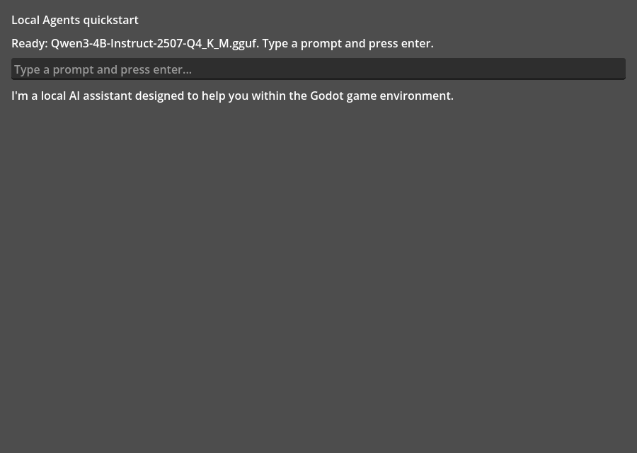
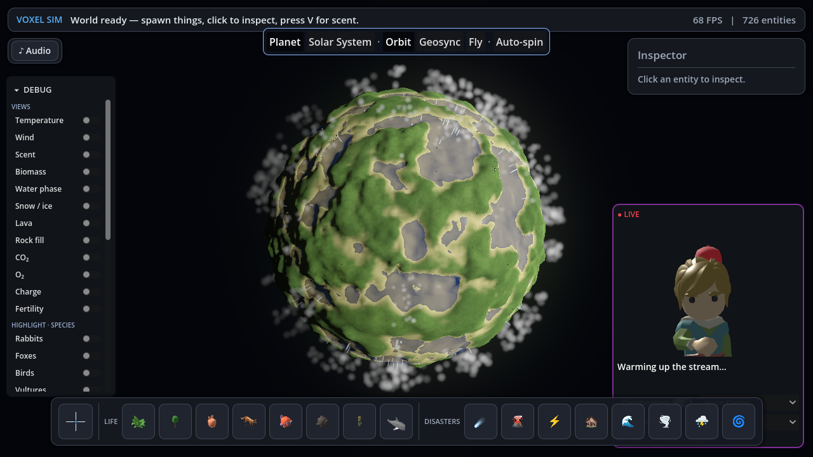

# Local Agents

This is a plugin for the Godot game engine that runs a local Large Language Model (LLM) inside your
game. The backend is [llama.cpp](https://github.com/ggml-org/llama.cpp), so it runs on the player's
own machine: no cloud service, no API key, no internet connection needed. A `LocalAgentsAgent` node
loads a .gguf model and gives you two things at once, a text reply and an action a creature or NPC
can act on.

Most game characters either follow a script or pick from a list of pre-written lines. Here the model
writes the dialogue while the game is being played, and it can decide what a character should do
next, with the game turning that decision into an action.



## How the pieces fit

There are three parts, and two of them you download once.

The model is a .gguf file, the quantized format llama.cpp uses. The default is
Qwen3-4B-Instruct-2507 at Q4_K_M, resolved from `user://local_agents/models/qwen3-4b-instruct/` (or
the in-repo `addons/local_agents/models/` copy the build script can fetch). Any .gguf works, so you
can swap the model without touching code.

The native extension is a C++ GDExtension (`localagents`) wrapping llama.cpp for text generation,
whisper.cpp for transcription, and Piper for speech, all embedded, all local.

The plugin is the Godot side: the agent node, a memory graph resource, and the editor panel you
download models from.

## Getting set up

You need the native extension and a model. Neither is committed to the repo, so a fresh clone will
not run until you have both.

For the extension, either download a prebuilt one or build it yourself. The
[Build Extension (Cross-Platform)](.github/workflows/build-extension.yml) workflow builds Linux,
Windows and macOS binaries and uploads each as an artifact named `localagents-<platform>-bin`.
Download the one for your platform and unzip it into
`addons/local_agents/gdextensions/localagents/bin/`. To build it instead:

```bash
cd addons/local_agents/gdextensions/localagents
./scripts/fetch_dependencies.sh                 # godot-cpp, llama.cpp, whisper.cpp, sqlite (+ default model & voices)
./scripts/build_extension.sh --platform macos   # or: linux | windows
```

This produces `bin/localagents.<platform>.{dylib,so,dll}` plus the bundled runtimes. Running
`fetch_dependencies.sh` without `--skip-models` also downloads the default model, which covers the
next step in one shot.

For the model on its own, open the project in Godot, enable the Local Agents plugin (Project >
Project Settings > Plugins), then use the Local Agents > Downloads panel at the bottom of the editor.
It puts the file where the plugin expects it.

If either piece is missing, the runtime status says so ("Native runtime missing...") instead of doing
nothing.

## Try it in 60 seconds

1. Get the native binary, above.
2. Get a model, above.
3. Open `addons/local_agents/examples/AgentQuickstart.tscn`, press play, type a prompt, press enter.

That scene is one Agent node plus a prompt box and a reply label. To build the same thing from
scratch, drop a `LocalAgentsAgent` node (once the plugin is enabled it shows up as Agent in the Add
Node dialog) and wire five lines:

```gdscript
@onready var agent: LocalAgentsAgent = %Agent

func _ready() -> void:
    agent.configure()                                  # picks up the default model + runtime
    agent.model_output_received.connect(_on_reply)     # fires when the model answers
    var result: Dictionary = agent.think("Say hello.") # runs the local model
    if not result.get("ok", true):
        push_warning("Agent unavailable: %s" % result.get("error", ""))

func _on_reply(text: String) -> void:
    print(text)
```

think(prompt) records the prompt, runs the local model, returns a result Dictionary, and emits
model_output_received with the text. For TTS/STT use say(text) / listen(). To drive game behaviour
instead of text, connect the action_requested(action, params) signal.

## Demos

Open `addons/local_agents/examples/DemoLauncher.tscn` and press play. It lists every demo below with
an Open button, ordered simplest to fullest.

1. AgentQuickstart.tscn: one Agent node, a prompt box, a reply. The smallest thing that works.
2. AgentActionsDemo.tscn: the reply becomes game actions instead of text, recoloring and pulsing an
   orb through enqueue_action.
3. AgentConversationDemo.tscn: two agents take turns, and every line is recorded in a shared memory
   graph.
4. ChatExample.tscn: a fuller chat UI with model settings, inference settings, runtime health, and
   saved conversations.
5. Agent3DExample.tscn: a talking agent in a 3D scene, with a setup checklist.
6. GraphExample.tscn: the memory graph resource on its own, nodes and edges. Runs without a model.
7. Play the planet: the game shell itself. See below.

## The planet sim

The plugin also ships one large example built to put the agent stack through its paces: an emergent
voxel planet, `addons/local_agents/scenes/simulation/voxel/VoxelWorld.tscn`. It's optional. Nothing
about using the agent library depends on it.

Underneath it is one layer of physics covering heat, water, wind, fire, lava and erosion, and the
rest follows from that: there is no scripted storm or scripted disaster anywhere in the code. Herds
forage, flee and hunt with kinship. Most of the time they run on cheap built-in rules, because asking
a language model about every animal every frame would be far too slow. When something unfamiliar
happens, that animal asks the local model what to do, and the answer becomes an action in the world.
There is also an optional streamer. It runs the same loaded model on its own context, not a second
copy in memory, and narrates the sim live in a generated voice. All of it runs offline on one
machine.



It self-harnesses for non-interactive runs:

```bash
# headless smoke boot: prints one SIM_REPORT={...} line, then quits
godot --headless res://addons/local_agents/scenes/simulation/voxel/VoxelWorld.tscn -- --run-frames=300

# windowed screenshot
godot res://addons/local_agents/scenes/simulation/voxel/VoxelWorld.tscn -- --shoot=/tmp/shot.png --overview
```

One gotcha worth knowing: a new class_name or .gdextension only registers after an editor scan. If
Godot says a class is missing, run `godot --headless --editor --quit-after 400` once and try again.

## Tests

```bash
scripts/agent_harness.sh fast       # quick sweep
scripts/agent_harness.sh all        # everything
scripts/agent_harness.sh bounded    # bounded runtime-heavy suite
scripts/agent_harness.sh extension  # check the GDExtension loads
scripts/agent_harness.sh lint       # typing and process gates
```

Run one module through the canonical helper, never launch a test_*.gd directly:

```bash
scripts/run_single_test.sh test_agent_integration.gd
```

## Notes

Runtime is scene-first and resource-driven. Simulation-authoritative compute targets GPU/native and
fails fast (GPU_REQUIRED / NATIVE_REQUIRED) rather than silently degrading; the one legitimate CPU
form is the headless/no-GPU fallback.

Process and Godot rules are canonical in CLAUDE.md and GODOT_BEST_PRACTICES.md; ARCHITECTURE_PLAN.md
tracks breaking changes. The emergent-design rule the sim is built on lives in
`addons/local_agents/scenes/simulation/voxel/EMERGENCE.md`.

---

This project started on 2024-03-14 as MindGame, a hand-rolled C# / LlamaSharp Godot plugin for
loading a .gguf model and chatting with it locally. At the time the local-LLM binding it depended on
was too new for the coding assistants of the day to know, so there was no shortcut, it had to be
written by hand. Over about 2.3 years and roughly 830 commits it grew into this project: a GDScript
addon backed by a native C++/llama.cpp GDExtension, with the voxel planet as the live showcase.
