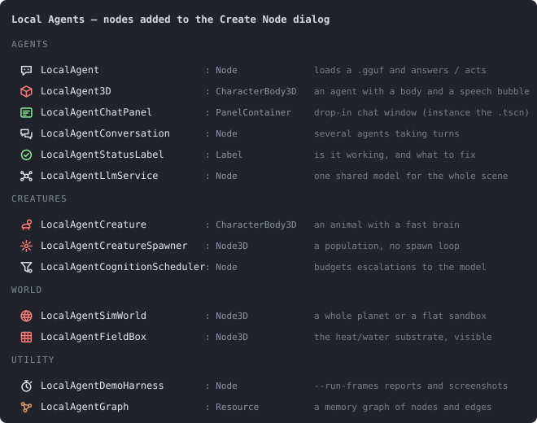

# Local Agents

This is a plugin for the Godot game engine that runs a local Large Language Model (LLM) inside your
game. The model runs on the player's own machine, so there is no cloud service, no API key, and no
internet connection needed. Load a .gguf model file and you're going!

Most game characters either follow a script or pick from a list of pre-written lines. Here the model
writes the dialogue while the game is being played. It can also decide what a character should do
next, and the game turns that decision into an action.


## The planet demo

The largest example that ships with the plugin is a small planet that runs itself.

Underneath everything is one layer of physics covering heat, water, air, fire and rock. The rest
follows from that. Rain falls where water evaporated and then cooled. A volcano erupts where pressure
built up under rock and had nowhere else to go. There is no "make a storm" function anywhere in the
code, and no scripted disasters.

Animals live on the surface. They eat, drink, flee, hunt, form herds and raise young. Most of the
time they run on cheap built-in instincts, because asking a language model about every animal every
frame would be far too slow. When something unfamiliar happens, that animal asks the model what to
do, and the answer becomes an action in the world.

There is also an optional commentator. It is a second copy of the model that watches the simulation
and talks about what is happening out loud, in a generated voice.

All of it runs offline on one machine.

## How the pieces fit

There are three parts, and two of them you download once.

The model is a .gguf file, the quantized format llama.cpp uses. The default is Qwen3-4B at Q4_K_M,
which needs roughly 4GB. Smaller models like Qwen3-0.6B run on much less at the cost of quality, and
any .gguf works, so you can swap the model without touching code.

The native extension is a C++ GDExtension wrapping
[llama.cpp](https://github.com/ggml-org/llama.cpp) for generation, whisper.cpp for transcription, and
Piper for speech. It can either load the model in-process or talk to a llama-server over HTTP, which
is useful when several agents share one model. There is also a SQLite-backed graph store with vector
search for agent memory.

The plugin is the Godot side: an agent node, a memory graph resource, the creature behaviour stack,
and the editor panel you download models from.

Speed is what shapes most of the design. Generation takes hundreds of milliseconds and a game draws
sixty frames a second, so nothing can call the model on the frame path. Requests go out on a worker
thread through a shared scheduler with a hard budget (two in flight, four per second across the whole
world), and a creature only escalates to the model when its cheap reinforced rules do not already
have a confident answer. If the model is busy or absent, the creature falls back to those rules and
keeps going.

The planet's physics is the same story one level down. It runs as GPU compute shaders over the voxel
grid rather than in GDScript, and only where something is actually happening. Quiet regions tick
slowly or sleep, and activity wakes its neighbours, so a fire or a flood grows its own bubble of
compute at the speed the phenomenon spreads.

## Just want to play it?

Prebuilt desktop builds are on the [Releases page](https://github.com/adammikulis/local-agents/releases)
— macOS and Linux. **Windows has no package yet:** the extension compiles in CI, but CI does not
collect its llama/ggml runtime DLLs, so a Windows build cannot be assembled. Build from source on
Windows in the meantime.

The rest of this section is for working on it in the editor.

## Getting set up

You need the native extension and a model. Neither is committed to the repo.

For the extension, either download a prebuilt one or build it yourself. The
[Build Extension](.github/workflows/build-extension.yml) workflow publishes an artifact called
localagents-<platform>-bin for Linux, Windows and macOS. Unzip it into
`addons/local_agents/gdextensions/localagents/bin/`. To build it instead:

```bash
cd addons/local_agents/gdextensions/localagents
./scripts/fetch_dependencies.sh                  # godot-cpp, llama.cpp, whisper.cpp, sqlite
./scripts/build_extension.sh --platform macos    # or: linux | windows
```

For the model, open the project in Godot, click Project > Project Settings > Plugins > Enable (Local
Agents), then open the Local Agents panel in the bottom bar and use the Downloads tab. It puts the
file where the plugin expects it.

If either one is missing the plugin tells you which, and what to do about it.

## What you get in the editor

Once the plugin is enabled, these show up in Add Node and in the Create Resource dialog. To reach Add
Node, right-click a node in the Scene dock and click Add Child Node. Type "LocalAgent" to filter to
them.



Most of what the examples do is these nodes with their properties filled in, so you can build the
same thing without writing code. The icon colours follow Godot's own convention, so a red icon is a
3D node, green is UI, orange is a resource.

## Using it in your own project

Add a LocalAgent node to a scene and connect to it:

```gdscript
@onready var agent: LocalAgent = $LocalAgent

func _ready() -> void:
    agent.think_completed.connect(_on_reply)
    agent.think_async("Say hello in one short sentence.")

func _on_reply(result: Dictionary) -> void:
    if result.get("ok", false):
        print(result["text"])
    else:
        push_warning(result.get("error", "agent unavailable"))
```

think_async() runs the model on a worker thread and gives you the result back on the main thread, so
the game keeps drawing while it generates. There is a blocking think() as well, but it freezes the
frame until the model finishes, so save that for tools and tests.

Call speak(text) to say a line out loud through Piper. transcribe(path) turns an audio file into text through
whisper, and it needs the native runtime. Neither one records audio, so capturing a microphone is
still your job.

To have the model drive behaviour instead of producing text, connect its action_requested(action,
params) signal and decide in your own code what each action does.

## Examples

Open `addons/local_agents/examples/DemoLauncher.tscn` and press play. It lists every example with an
Open button. They build on each other so it is worth going in order.


1. AgentQuickstart.tscn: one agent, a prompt box, a reply. The smallest thing that works.
2. AgentActionsDemo.tscn: the model's reply becomes game actions instead of text. Buttons fire the
   same actions, so this one still works with no model installed.
3. AgentConversationDemo.tscn: two agents take turns, and every line is stored in a shared memory
   graph.
4. ChatExample.tscn: a full chat interface with model settings, sampling settings and saved
   conversations.
5. Agent3DExample.tscn: a talking agent in a 3D scene.
6. GraphExample.tscn: the memory graph on its own. Runs without a model.
7. TutorialDemo.tscn: the in-game tutorial sequencer driving a scripted walkthrough.
8. ThinkingCreatureDemo.tscn: one creature with the full cognition stack — drives, learning, and a
   sparing local-LLM slow brain.
9. CoreCreatureSmoke.tscn: the creature library with no sim around it, which is the drop-in case.
10. BoxFieldDemo.tscn: the material field on a small box grid, for looking at one channel at a time.
11. SimWorldPlanetDemo.tscn: the whole planet behind the one-node `LASimWorld` facade.
12. Play the planet: the game shell itself — `game/VoxelWorld.tscn`, launched from the same
    launcher. It needs a real window, because the GPU field has no compute device headless.

The first eleven live in `addons/local_agents/examples/`, and `scripts/agent_harness.sh lint` keeps
that directory, the demo catalogue and `docs/DEMOS.md` in agreement.

The planet is `addons/local_agents/game/VoxelWorld.tscn`. It can also run itself and report back,
which is how it gets tested:

```bash
# run 300 frames, print one SIM_REPORT={...} line, quit
scripts/run_sim_offscreen.sh --path . addons/local_agents/game/VoxelWorld.tscn -- --run-frames=300

# take a screenshot
godot addons/local_agents/game/VoxelWorld.tscn -- --shoot=/tmp/shot.png --overview
```

If you only want the agent library, delete `addons/local_agents/game/`. Nothing outside it points in,
and `scripts/agent_harness.sh lint` proves that on every run by staging a game-free copy and
force-loading every script in it. See
[addons/local_agents/docs/USAGE.md](addons/local_agents/docs/USAGE.md) for what else the library
boundary does and does not cover.

## Tests

```bash
scripts/agent_harness.sh fast        # quick sweep
scripts/agent_harness.sh all         # everything
scripts/agent_harness.sh extension   # check the GDExtension loads
scripts/agent_harness.sh lint        # typing and process gates
```

One gotcha worth knowing: a new class_name or .gdextension only registers after an editor scan. If
Godot says a class is missing, run `godot --headless --editor --quit-after 400` once and try again.

## More reading

[addons/local_agents/docs/USAGE.md](addons/local_agents/docs/USAGE.md) covers using the library in
your own project, the two adapter contracts the creature behaviour talks through, and how to add a
new species with a JSON file.

[addons/local_agents/sim/EMERGENCE.md](addons/local_agents/sim/EMERGENCE.md) explains the rule the
simulation is built on: behaviour comes from simple local rules interacting, never from scripted
special cases.

CLAUDE.md and GODOT_BEST_PRACTICES.md cover contributor process and Godot conventions.

---

This project started as MindGame, a hand-rolled C# Godot plugin for local LLMs, which had one of the
first in-engine coding agents.
